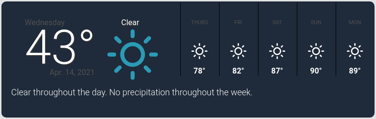

# local-weather

local-weather is a single page weather application I built to practice working with JSON data from third-party APIs.



## Installation

Node.js is required to run this project locally. Node can be downloaded at [nodejs.org](https://nodejs.org/en/).

Clone the repo

```sh
git clone https://github.com/n-ulricksen/local-weather.git
cd local-weather
```

Install client & server dependencies

```sh
npm run client-install
npm install
```

## Usage

Start the client and server.

```sh
npm run dev
```

Check out the running application at

```
localhost:3000
```

## Contributing

Pull requests welcome and appreciated!

## License

[MIT](https://choosealicense.com/licenses/mit/)
